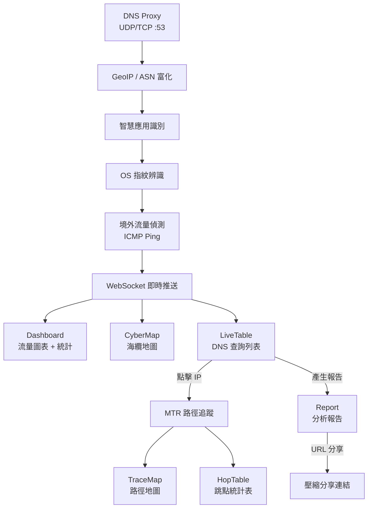

# 01. Introduction and Goals

## Requirements Overview
SRRT (Real-time DNS Traffic Analyzer) 是一個專為資安分析設計的即時 DNS 流量監控系統。
主要功能包括：
- **DNS 代理伺服器 (DNS Proxy)**: 使用 `miekg/dns` 監聽 UDP/TCP 53 埠，轉發查詢至上游解析器，同時攔截並富化回應。
- **即時資料推送 (WebSocket)**: 富化後的 DNS 記錄即時串流至前端。
- **地理位置與 ASN 標記 (GeoIP)**: 整合 MaxMind MMDB 提供國家、座標、ASN/ISP 資訊。
- **智慧網域識別引擎**: 三層識別（精確匹配 → 正規表達式 → 啟發式推斷）。
- **OS 指紋辨識**: 根據 DNS 查詢模式識別裝置作業系統（Android/iOS/Windows）。
- **境外流量偵測**: 比對結果 IP 國家與本機國家，非本地 IP 觸發 ICMP ping 測量延遲。
- **前端視覺化戰情室**: 含即時流量圖表、統計儀表板。
- **海纜地圖 (CyberMap)**: 整合全球海纜資料，並標註「台灣出發可用路徑」。
- **MTR 路徑追蹤工具**: 使用 MTR (My Traceroute) 提供即時網路路徑追蹤，含丟包率、延遲統計（Avg/Best/Worst/StDev）與 MapLibre GL 地圖視覺化。支援三階段地理修正（延遲啟發式、rDNS PoP 解析、ccTLD 輔助）。
- **報告產生與分享**: 支援產生分析報告（ReportModal），並透過 URL 壓縮編碼（pako deflate）分享 DNS 記錄與追蹤結果。
- **引導式導覽 (Guided Tour)**: 使用 react-joyride 提供首次使用者互動式功能導覽。

## Quality Goals
1. **即時性 (Real-time)**: 能夠快速處理並展示 DNS 流量，WebSocket 即時推送。
2. **隱私優先 (Privacy First)**: 數據純 In-Memory 存儲，無資料庫設計，重啟即清空。
3. **易用性 (Usability)**: 提供直觀的地理圖表與數據表格，並附帶引導式導覽。
4. **可分享性 (Shareability)**: 支援透過 URL 壓縮編碼分享 DNS 記錄、追蹤結果與分析報告。

## Stakeholders
- 資安分析師
- 網路管理員
- 開發團隊
