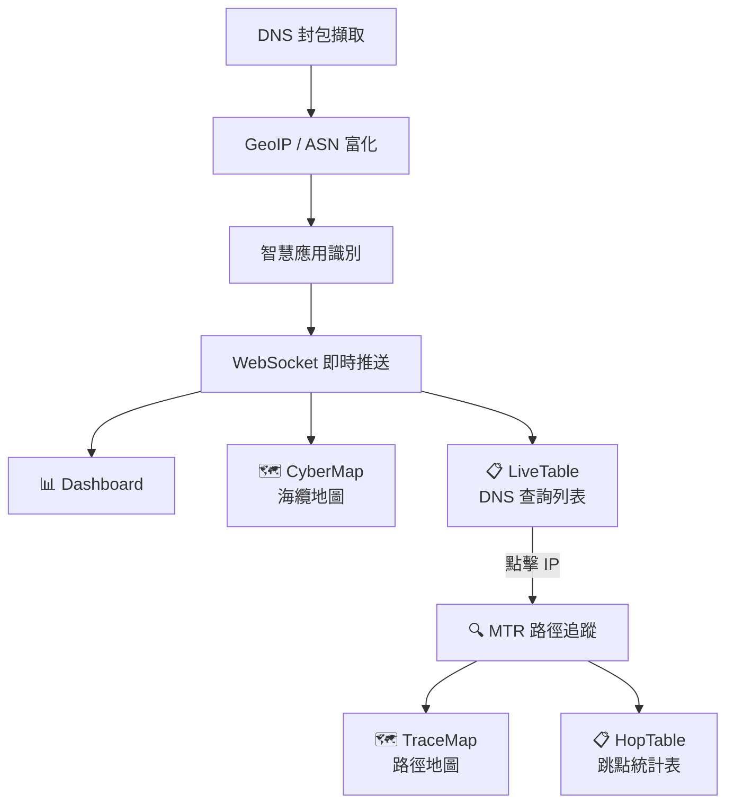

# 01. Introduction and Goals

## Requirements Overview
SRRT (Real-time DNS Traffic Analyzer) 是一個專為資安分析設計的即時 DNS 流量監控系統。
主要功能包括：
- 底層封包擷取 (Packet Sniffing)
- 即時資料推送 (WebSocket)
- 地理位置與 ASN 標記 (GeoIP)
- 智慧網域識別引擎
- 前端視覺化戰情室
- **海纜地圖 (CyberMap)**: 整合全球海纜資料，並標註「台灣出發可用路徑」。
- **MTR 路徑追蹤工具**: 使用 MTR (My Traceroute) 提供即時網路路徑追蹤，含丟包率、延遲統計（Avg/Best/Worst/StDev）與 MapLibre GL 地圖視覺化。

## Quality Goals
1. **即時性 (Real-time)**: 能夠快速處理並展示 DNS 流量。
2. **隱私優先 (Privacy First)**: 數據純 In-Memory 存儲，無資料庫設計。
3. **易用性 (Usability)**: 提供直觀的地理圖表與數據表格。

## Stakeholders
- 資安分析師
- 網路管理員
- 開發團隊
