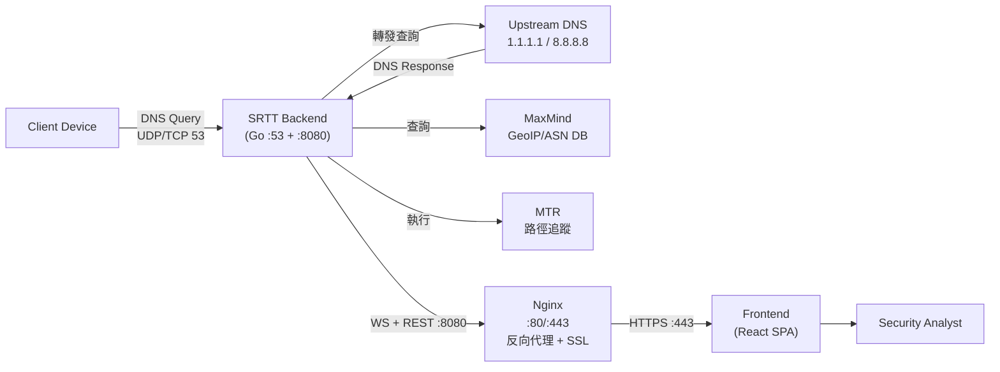

# 03. System Scope and Context

## Business Context
SRTT 作為 DNS 代理伺服器，監聽 UDP/TCP 53 埠接收用戶端 DNS 查詢，轉發至上游解析器後攔截回應進行富化（GeoIP、ASN、應用識別、OS 指紋、境外偵測），再透過 WebSocket 即時推送給前端 Dashboard。

## Technical Context
- **External Systems**:
    - **Upstream DNS Resolvers**: 上游 DNS 伺服器（預設：1.1.1.1、8.8.8.8、1.0.0.1、8.8.4.4），可透過 `DNS_UPSTREAMS` 環境變數設定。
    - **MaxMind GeoIP Database**: 提供 IP 地理位置、ASN/ISP 查詢（GeoLite2-City + GeoLite2-ASN MMDB）。
- **External Tools**:
    - **MTR (My Traceroute)**: 呼叫系統 `mtr --report --json --report-cycles 1 --max-ttl 30` 獲取網路路徑追蹤與統計資訊（丟包率、延遲分佈）。支援 TCP/ICMP 模式。
- **Infrastructure**:
    - **Nginx**: 反向代理，提供 HTTPS（Let's Encrypt）、靜態檔案服務、WebSocket 代理。
- **Users**:
    - **Security Analyst**: 透過 Dashboard 監控異常 DNS 行為，使用報告功能分享分析結果。
