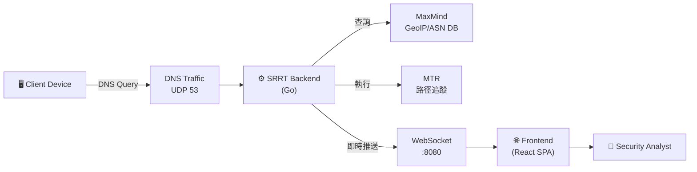

# 03. System Scope and Context

## Business Context
SRRT 監聽網路介面上的 DNS 流量 (UDP 53)，並將解析後的結果透過 WebSocket 推送給前端 Dashboard 進行展示。

## Technical Context
- **External Systems**:
    - **MaxMind GeoIP Database**: 提供 IP 地理位置查詢。
    - **DNS Traffic**: 原始的網路封包數據。
    - **Submarine Cable Data**: 整合全球海纜與台灣可用路徑資料 (JSON)。
- **External Tools**:
    - **MTR (My Traceroute)**: 呼叫系統 `mtr --report --json` 獲取網路路徑追蹤與統計資訊（丟包率、延遲分佈）。
- **Users**:
    - **Security Analyst**: 透過 Dashboard 監控異常 DNS 行為。
