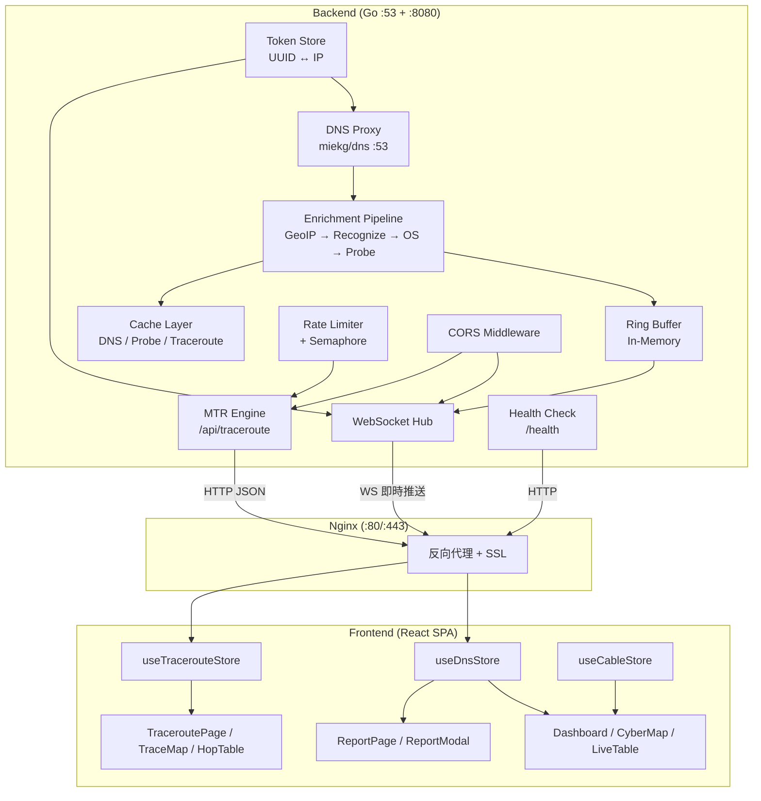
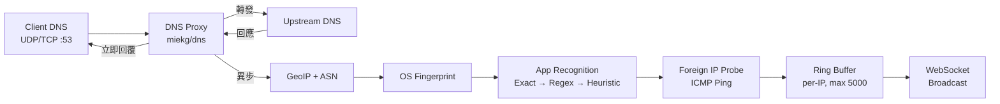

# 05. Building Block View

## Level 1: White Box Overall System
- **Backend (Go)**: 負責 DNS 代理、查詢轉發、回應富化（GeoIP/ASN/應用識別/OS 指紋/境外偵測）、WebSocket 即時推送及 REST API。
- **Frontend (React)**: 負責接收資料、狀態管理及視覺化展示，含報告產生與分享功能。
- **Nginx**: 反向代理，提供 HTTPS、靜態檔案服務、WebSocket 代理。

## Level 2: Backend Internals

### Packages (`backend/internal/`)

| Package | 職責 |
|---------|------|
| `dns/` | DNS 代理伺服器（UDP/TCP :53），查詢轉發、回應快取、異步富化管線 |
| `api/` | HTTP 路由（REST + WebSocket）、CORS 中間件、Traceroute handler |
| `auth/` | Token Store（UUID ↔ IP 雙向映射），自動產生 token |
| `buffer/` | Per-IP Ring Buffer（5000 筆/session、2000 session 上限、10min 閒置清除） |
| `geoip/` | MaxMind MMDB 查詢（Country、Coords、ASN/ISP） |
| `recognition/` | 三層應用識別（Exact → Regex → Heuristic） |
| `osfingerprint/` | DNS 查詢模式 OS 辨識（Android/iOS/Windows） |
| `traceroute/` | MTR 執行與解析、rDNS PoP 解析、TLD 輔助、結果快取 |
| `ratelimit/` | Per-token 速率限制 + 全域 Semaphore 併發控制 |
| `types/` | 共用 `DNSQueryRecord` struct |

### DNS 富化管線

### HTTP API 端點

| Endpoint | Method | Auth | 用途 |
|----------|--------|------|------|
| `/ws` | WebSocket | Token (query param) | 即時 DNS 記錄串流，連線時發送歷史快照 |
| `/api/token` | GET | None | 取得/建立 session token，回傳 token、client IP、localCountry、dnsPublicIP |
| `/api/traceroute` | GET | Token (Bearer / query) | 執行 MTR，含快取檢查 + 速率限制 + 併發控制 |
| `/health` | GET | None | 健康檢查（status、uptime、session count、client count） |

## Level 3: Frontend Components

### Pages（Lazy-loaded）
- **Main Dashboard**（`/`）: 預設頁面，左右分割面板（CyberMap + 右側面板）。
- **TraceroutePage**（`/traceroute`）: 獨立全頁路徑檢視器，大螢幕 `grid-cols-[2fr_3fr]`（左地圖右表格），手機版垂直堆疊。支援 URL 分享（`?zdata=` 壓縮編碼）與直接執行（`?target=&token=`）。
- **ReportPage**（`/report`）: 獨立報告檢視頁面。

### Zustand Stores
- **useDnsStore**: DNS 記錄狀態、監控 IP、主題切換、token 管理、批次緩衝（500ms throttle）、壓縮匯出。
- **useTracerouteStore**: 追蹤結果、歷史紀錄（sessionStorage, max 20）、載入狀態、Mock 資料。
- **useCableStore**: 海纜 GeoJSON、選中海纜 ID、應用程式→海纜映射。

### UI Components
- **CyberMap**: 基於 MapLibre GL 的海纜地圖，強調台灣可用路徑。左右面板支援拖動分割（預設各佔 50%）。
- **LiveTable**: 即時 DNS 查詢列表。ISP/Cloud Provider badge（AWS、GCP、Azure、Cloudflare、Akamai 等），點擊 Domain 或 Result IP 觸發 MTR 追蹤。
- **LiveTrafficChart**: 基於 Recharts 的即時流量圖表。
- **TrafficDashboard**: 流量統計儀表板（指標與圖表）。
- **TracerouteDrawer**: 側邊抽屜，嵌入 `HopTable`（緊湊模式）顯示 MTR 結果，含歷史紀錄與分享功能。
- **HopTable**: 共用跳點表格元件（`TraceroutePage` 與 `TracerouteDrawer` 共用）。欄位：# / IP / ASN·ISP / Country / Loss% / Avg（含進度條）/ Best / Worst / StDev。支援 `compact` 模式。
- **TraceMap**: 基於 MapLibre GL 的路徑地圖（僅 `TraceroutePage`）。圓形標記依延遲漸變色（綠→黃→紅），支援 Popup 與自動 fitBounds。
- **DnsSetupBanner**: DNS 設定說明，動態讀取 `window.location.hostname`，含一鍵複製。
- **ReportModal**: 報告產生表單（app metadata、URL、logo），統計國內外流量佔比。
- **ReportView**: 報告檢視 Overlay，含編輯/關閉操作。
- **AboutModal**: 應用程式資訊與致謝。
- **AppInfoTooltip**: 應用程式詳細資訊 Tooltip。
- **ErrorBoundary**: 錯誤邊界元件。

### Hooks
- **useDnsStream**: WebSocket 連線管理，含 token 取得、自動重連（指數退避）、本地國家快取（7 天 TTL）。
- **useMockDnsStream**: Mock 模式 DNS 串流（`VITE_USE_MOCK=true`）。
- **useSharedReport**: 解壓 URL `?zdata=` 參數，載入共享的 DNS 記錄與追蹤結果。
- **useTour**: react-joyride 引導式導覽管理。
