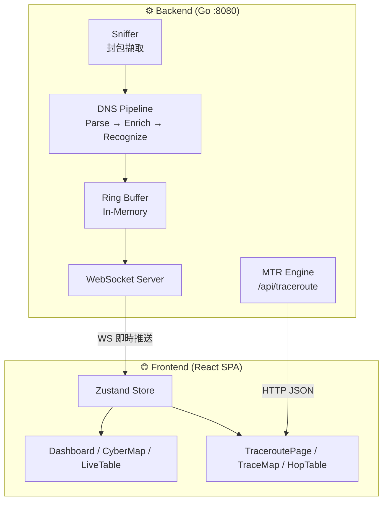
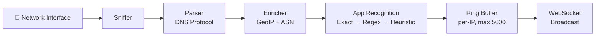

# 05. Building Block View

## Level 1: White Box Overall System
- **Backend (Go)**: 負責封包擷取、解析、富化 (GeoIP) 及 WebSocket 通訊。
- **Frontend (React)**: 負責接收資料、狀態管理及視覺化展示。

## Level 2: Backend Internals
- **Sniffer**: 監聽網路介面。
- **Parser**: 解析 DNS 協定。
- **Buffer**: Ring Buffer 管理記錄。
- **Enricher**: 整合 GeoIP 與 ASN 資訊。
- **App Recognition**: 根據規則識別應用程式。
- **MTR Engine**: 提供 HTTP API (`/api/traceroute`) 進行網路路徑追蹤。使用 `mtr --report --report-cycles 10 --json` 執行，解析 JSON 輸出並補全 GeoIP/ASN 資訊。每跳回傳 Loss%、Avg、Best、Worst、StDev 統計。

## Level 3: Frontend Components
- **Dashboard**: 即時流量監控儀表板。
- **CyberMap**: 基於 MapLibre GL 的海纜地圖，強調台灣可用路徑。左右面板支援拖動分割（預設各佔 50%）。
- **DataHandler**: 負責海纜資料 (GeoJSON) 的動態轉換與載入。
- **DnsSetupBanner**: 顯示於右側面板頂部的 DNS 設定說明元件。動態讀取 `window.location.hostname` 作為 DNS 目標，支援展開/收合操作說明，含一鍵複製功能。
- **LiveTable**: 即時 DNS 查詢列表。ISP/Cloud Provider 欄位（含 AWS、GCP、Azure、Cloudflare、Akamai 等雲端服務商識別 badge）預設可見。點擊 Domain 或 Result IP 欄位可直接觸發 MTR 路徑追蹤。
- **TracerouteDrawer**: 側邊抽屜，嵌入 `HopTable`（緊湊模式）顯示 MTR 結果。
- **HopTable**: 共用跳點表格元件（`TraceroutePage` 與 `TracerouteDrawer` 共用）。欄位：# / IP / ASN·ISP / Country / Loss% / Avg（含進度條） / Best / Worst / StDev。支援 `compact` 模式。
- **TraceMap**: 基於 MapLibre GL 的嵌入式路徑地圖（僅出現在 `TraceroutePage`）。圓形標記依延遲漸變色（綠→黃→紅），線條區分海底電纜（曲線）與一般路徑，支援 Popup 與自動 fitBounds。
- **TraceroutePage**: 獨立全頁路徑檢視器，大螢幕 `grid-cols-[2fr_3fr]`（左地圖右表格），手機版垂直堆疊。支援 URL 分享（`?zdata=` 壓縮編碼）與直接執行（`?target=&token=`）。
