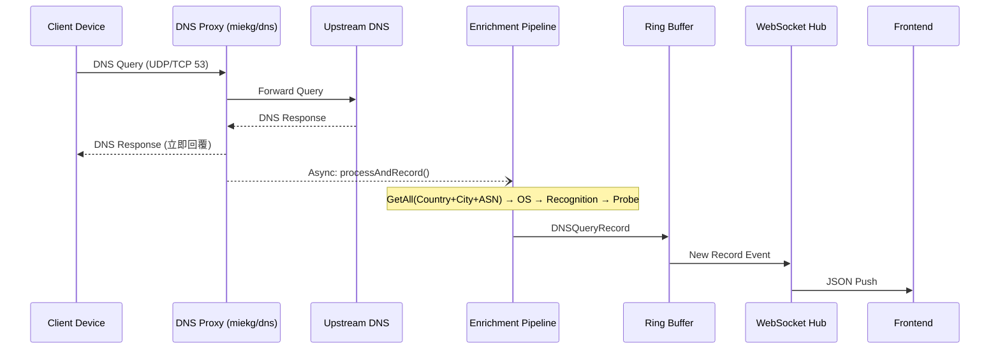
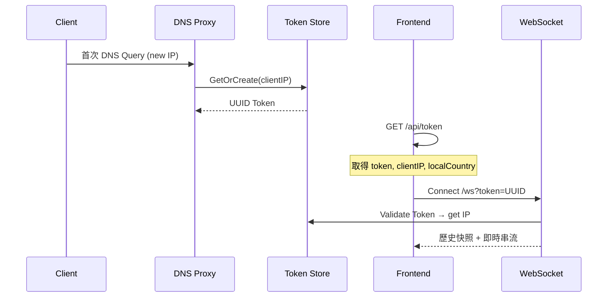
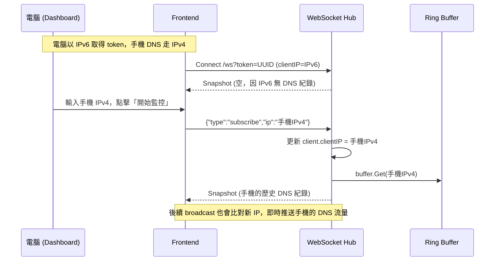
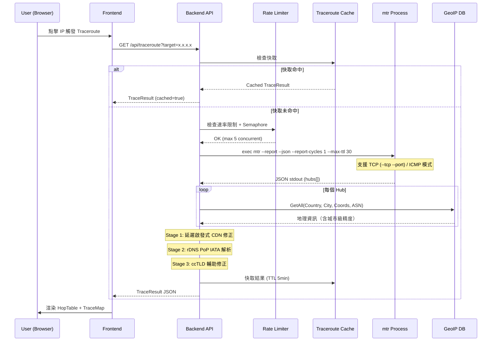
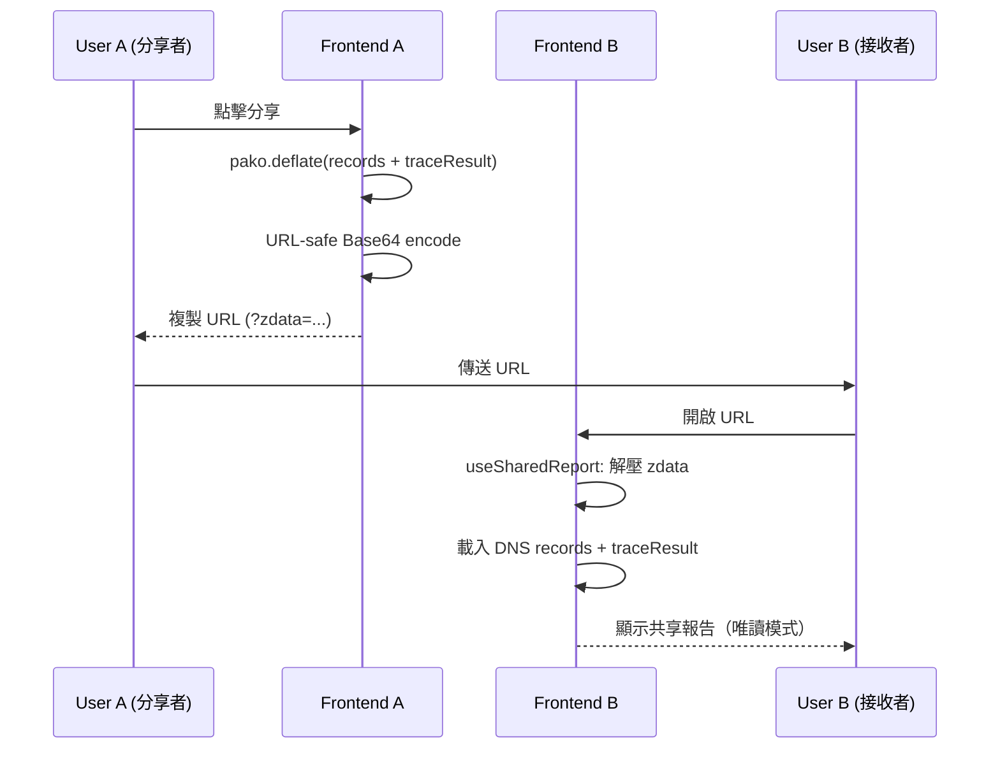

# 06. Runtime View

## DNS Traffic Processing
1. **DNS Proxy** 接收用戶端 DNS 查詢（UDP/TCP :53）。
2. **Forward** 轉發至上游 DNS 解析器，取得回應後**立即回覆**用戶端。
3. **Async Enrichment** 異步進行富化（不阻塞 DNS 回應）：
   a. **GeoIP** 透過 `GetAll()` 一次查詢 Country、City、Subdivision、Coords、ASN/ISP。
   b. **OS Fingerprint** 根據查詢域名模式辨識裝置 OS。
   c. **App Recognition** 三層識別應用程式類型。
   d. **Foreign Probe** 境外 IP 觸發 ICMP Ping 測量延遲。
4. **Buffer** 存入 Per-IP Ring Buffer。
5. **WebSocket** 推送更新至前端。

## Token Authentication Flow
用戶端首次 DNS 查詢或請求 `/api/token` 時自動取得 UUID token。

## Cross-device Subscribe Flow
當使用者從電腦 Dashboard 監控其他裝置（如手機）的 DNS 流量時，因 Dual-stack 網路環境可能導致電腦（HTTP）與手機（DNS）使用不同 IP 位址（如 IPv6 vs IPv4），WebSocket Hub 的 IP 過濾會不匹配。透過 `subscribe` 機制，前端可動態切換後端的監控目標 IP。

## MTR Path Tracing
使用者在 LiveTable 點擊 IP 後觸發 MTR 路徑追蹤，後端執行 `mtr --report --json` 並回傳結果。

## Shared Report Flow
使用者可透過壓縮 URL 分享 DNS 記錄與追蹤結果。

