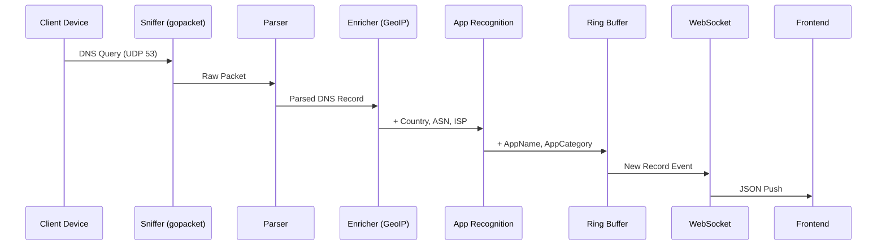
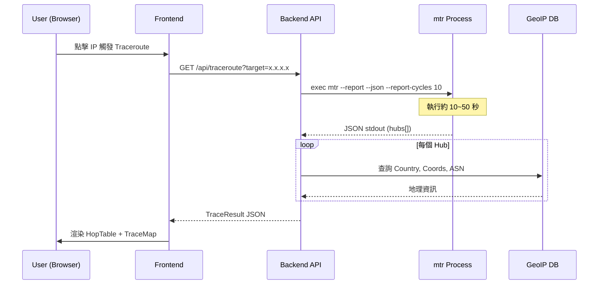

# 06. Runtime View

## DNS Traffic Processing
1. **Sniffer** 擷取封包。
2. **Parser** 提取 DNS Query/Answer。
3. **Enricher** 查詢 GeoIP/ASN。
4. **Recognition** 識別應用程式類型。
5. **Buffer** 存入 Ring Buffer。
6. **WebSocket** 推送更新至前端。

## MTR Path Tracing
使用者在 LiveTable 點擊 IP 後觸發 MTR 路徑追蹤，後端執行 `mtr --report --json` 並回傳結果。

