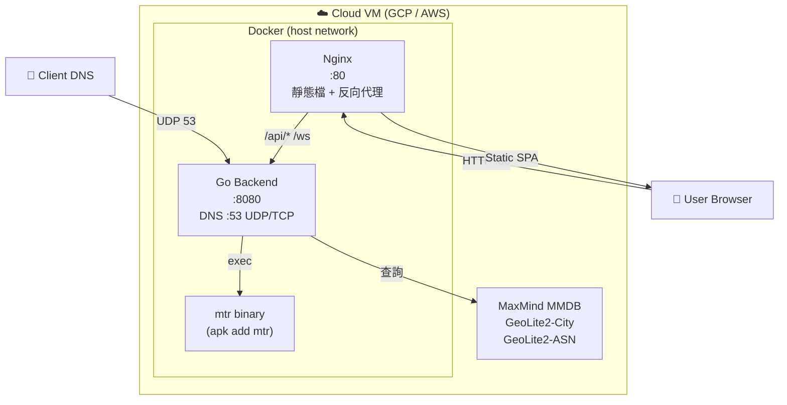

# 07. Deployment View

## Docker Environment
- **Development**: 使用 `docker-compose.dev.yml`，支援 Hot Reload。
- **Production**: 使用 `docker-compose.prod.yml`，包含 Nginx 反向代理並啟用 host 網路。

## Infrastructure
- 可部署於 GCP, AWS 等雲端平台。
- 需要開啟 UDP 53 與 TCP 80 埠。

## Runtime Dependencies
- Backend Docker 映像需安裝 `mtr` 套件（alpine: `apk add mtr`），用於 MTR 路徑追蹤功能。
- MTR API timeout 設為 60 秒，以容納 `--report-cycles 10` 在高延遲網路的執行時間。
