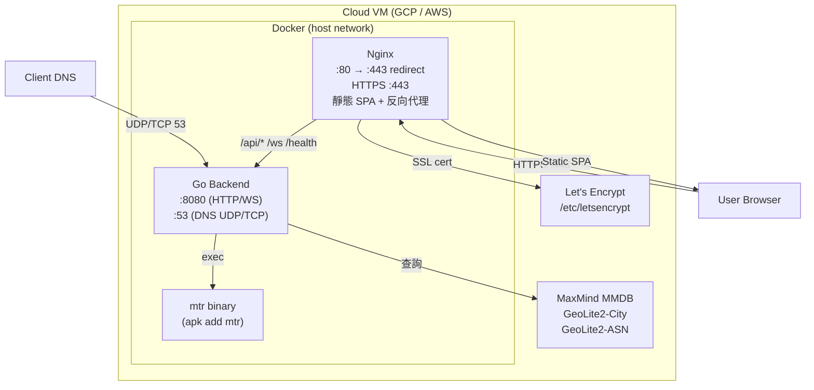

# 07. Deployment View

## Docker Environment
- **Development**: 使用 `docker-compose.dev.yml`，支援 Hot Reload（Backend: Air, Frontend: Vite HMR）。
- **Production**: 使用 `docker-compose.prod.yml`，Nginx 反向代理 + HTTPS（Let's Encrypt）+ host 網路模式。



## Production Security Hardening
- **Read-only root filesystem**: 容器內檔案系統唯讀，僅 tmpfs 可寫。
- **tmpfs**: `/tmp`（64MB, noexec, nosuid）用於暫存。
- **No new privileges**: 禁止提權。
- **Capabilities**: 僅授予 `NET_ADMIN`、`NET_RAW`、`NET_BIND_SERVICE`（DNS :53 所需）。
- **Memory limit**: 1GB per container。
- **Volume mounts**: MMDB、app.json 與 host-location.json 以 read-only 掛載。

## Development Environment
- Backend port: `1053:53`（DNS）、`8080:8080`（HTTP/WS）
- Frontend port: `80:5173`（Vite dev server）
- Backend Hot Reload: Air（`.air.toml`）
- Frontend Hot Reload: Vite HMR（polling mode for Docker）
- Go module cache: 使用 named volume `go_cache` 持久化

## Nginx Configuration
- **Domain**: `dns.zeroflare.tw`
- **SSL**: TLSv1.2+, Let's Encrypt certificates
- **Gzip**: 啟用壓縮
- **WebSocket proxy**: `/ws` → `:8080/ws`（Upgrade headers, 24h timeout）
- **API proxy**: `/api` → `:8080/api`
- **Static**: `/assets/` 1 年快取（immutable）、`/locales/` no-cache、`/` fallback to `/index.html`（SPA）

## Deployment Steps

### 步驟 1：準備 GeoIP 資料庫
至 MaxMind 官網註冊並下載 GeoLite2-City.mmdb 與 GeoLite2-ASN.mmdb，放置於 VM 上的 `backend/data/` 目錄（後續透過 volume 掛載進容器）。

### 步驟 2：Build & Push Image（CI/CD 或手動）
在 CI 環境或本機執行：

```bash
docker build -t <REGISTRY>/srtt-backend:latest ./backend
docker build -t <REGISTRY>/srtt-frontend:latest ./frontend
docker push <REGISTRY>/srtt-backend:latest
docker push <REGISTRY>/srtt-frontend:latest
```

`<REGISTRY>` 可為 Docker Hub、GCR、ECR 等 container registry。

### 步驟 3：準備 VM 部署檔
將 `docker-compose.prod.yml` 複製到 VM，並將其中的 `build:` 區塊替換為 `image:`：

```yaml
services:
  backend:
    image: <REGISTRY>/srtt-backend:latest
    # ... 其餘設定不變

  frontend:
    image: <REGISTRY>/srtt-frontend:latest
    # ... 其餘設定不變
```

### 步驟 4：設定環境變數
於 `docker-compose.prod.yml` 或 `.env` 中設定：
- `LOCAL_COUNTRY`：本地國碼（如 `TW`）。留空時改由 `host-location.json` 的 `country` 決定（見步驟 4.1）；環境變數優先。
- `DNS_PUBLIC_IP`：VM 公網 IP，供前端顯示 DNS 設定指引
- `NETWORK_INTERFACE`：VM 網卡名稱（GCP 預設 `ens4`）
- `HOST_LOCATION_PATH`：主機節點設定檔路徑（預設 `data/host-location.json`）

### 步驟 4.1：設定主機節點位置（多節點部署）
DNS 主機可能部署於不同國家（TW、JP…）。各節點掛載各自的 `backend/data/host-location.json`，
讓同一份映像檔不需重編譯即可部署到不同節點：

```json
{ "country": "TW", "label": "台灣節點", "coordinates": [121.5654, 25.033], "mapZoom": 6.2 }
```

- `country`：境內國碼，驅動境內/境外判定（等同 `LOCAL_COUNTRY`）。
- `label` / `coordinates` / `mapZoom`：經 `/api/token` 回傳給前端，決定地圖中心、縮放與節點顯示名稱。

設定來源優先序：`LOCAL_COUNTRY` 環境變數 > `host-location.json` 的 `country`。
設定檔不存在時，後端退回環境變數 / GeoIP，維持向後相容。

### 步驟 5：設定 SSL 憑證
使用 Certbot 或 Cloudflare 取得 HTTPS 憑證，放置於 VM 的 `/etc/letsencrypt` 目錄（容器以 read-only 掛載）。

### 步驟 6：啟動服務

```bash
docker compose -f docker-compose.prod.yml pull   # 拉取最新 image
docker compose -f docker-compose.prod.yml up -d   # 啟動服務
```

### 步驟 7：驗證服務
- DNS 功能：`dig @<PUBLIC_IP> google.com`
- 儀表板：瀏覽器開啟 `https://<DOMAIN>` 確認頁面正常
- WebSocket：確認 `wss://<DOMAIN>/ws` 連線正常

> **替代方案：** 若無 CI/CD 環境，可將 source code 放置於 VM 上，跳過步驟 2–3，直接執行 `docker compose -f docker-compose.prod.yml up -d --build` 在 VM 上建置並啟動。

## Infrastructure
- 可部署於 GCP, AWS 等雲端平台。
- 需要開啟 UDP/TCP 53（DNS）、TCP 80（HTTP redirect）、TCP 443（HTTPS）埠。

## Runtime Dependencies
- Backend Docker 映像需安裝 `mtr` 套件（alpine: `apk add mtr`），用於 MTR 路徑追蹤功能。
- MTR API timeout 設為 60 秒，以容納 `--report-cycles 1 --max-ttl 30` 在高延遲網路的執行時間。支援 TCP（預設 port 443）與 ICMP 模式。
- Dockerfile 使用多階段建構（multi-stage build）：`golang:1.25-alpine`（builder，go.mod 要求 Go 1.24+）→ `alpine:latest`（runner）。純靜態編譯（`CGO_ENABLED=0`），無 CGO 依賴。
