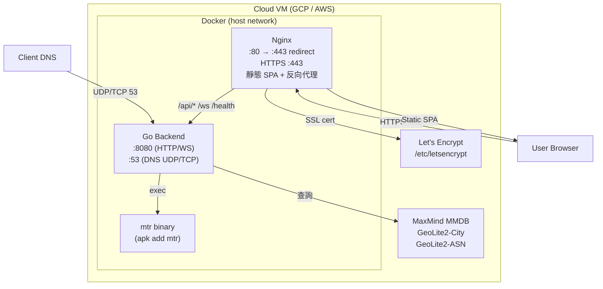

# 07. Deployment View

## Docker Environment
- **Development**: 使用 `docker-compose.dev.yml`，支援 Hot Reload（Backend: Air, Frontend: Vite HMR）。
- **Production**: 使用 `docker-compose.prod.yml`，Nginx 反向代理 + HTTPS（Let's Encrypt）+ host 網路模式。

## Production Security Hardening
- **Read-only root filesystem**: 容器內檔案系統唯讀，僅 tmpfs 可寫。
- **tmpfs**: `/tmp`（64MB, noexec, nosuid）用於暫存。
- **No new privileges**: 禁止提權。
- **Capabilities**: 僅授予 `NET_ADMIN`、`NET_RAW`、`NET_BIND_SERVICE`（DNS :53 所需）。
- **Memory limit**: 1GB per container。
- **Volume mounts**: MMDB 與 app.json 以 read-only 掛載。

## Development Environment
- Backend port: `1053:53`（DNS）、`8080:8080`（HTTP/WS）
- Frontend port: `80:5173`（Vite dev server）
- Backend Hot Reload: Air（`.air.toml`）
- Frontend Hot Reload: Vite HMR（polling mode for Docker）
- Go module cache: 使用 named volume `go_cache` 持久化

## Nginx Configuration
- **Domain**: `dns.zeroflare.tw`
- **SSL**: TLSv1.2+, Let's Encrypt certificates
- **Gzip**: 啟用壓縮
- **WebSocket proxy**: `/ws` → `:8080/ws`（Upgrade headers, 24h timeout）
- **API proxy**: `/api` → `:8080/api`
- **Static**: `/assets/` 1 年快取（immutable）、`/locales/` no-cache、`/` fallback to `/index.html`（SPA）

## Infrastructure
- 可部署於 GCP, AWS 等雲端平台。
- 需要開啟 UDP/TCP 53（DNS）、TCP 80（HTTP redirect）、TCP 443（HTTPS）埠。

## Runtime Dependencies
- Backend Docker 映像需安裝 `mtr` 套件（alpine: `apk add mtr`），用於 MTR 路徑追蹤功能。
- MTR API timeout 設為 60 秒，以容納 `--report-cycles 10` 在高延遲網路的執行時間。
- Dockerfile 使用多階段建構（multi-stage build）：`golang:1.25-alpine`（builder）→ `alpine:latest`（runner）。
