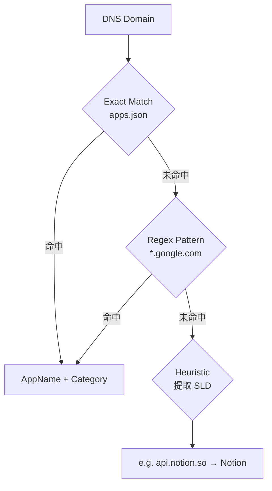
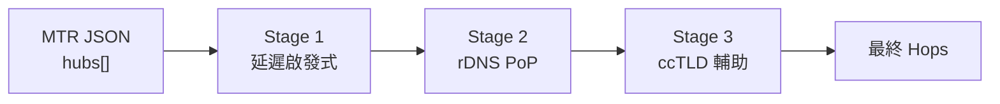

# 08. Concepts

## Domain Model
- **DnsQueryRecord**: 代表單次 DNS 查詢與其富化後的資訊（Country、City、Subdivision、ASN/ISP、座標、應用識別、OS 指紋、境外偵測結果）。
- **GeoResult**: 合併 GeoIP 查詢結果（Country、City、Subdivision、Coords、ASN、ISP），透過 `GetAll()` 一次查詢取得。
- **AppRule**: 應用程式識別規則（exact/regex/heuristic）。
- **Hop**: Traceroute 中的單一跳點（含 City、Subdivision、延遲統計、GeoIP、geoConfidence）。
- **TraceResult**: 完整的 Traceroute 結果（target、resolvedIP、hops、status、cached、mode、port、可觀測性欄位）。

## App Recognition (Three-tier)

## Traceroute Multi-stage Enrichment
MTR 結果經三階段地理修正，逐步提升 `geoConfidence`：

1. **延遲啟發式 (Latency Heuristic)**: 前後跳延遲差 < 10ms 但 GeoIP 國家不同，且為已知 CDN ASN → 沿用前一跳位置，標記 `geoConfidence: "low"`。
2. **rDNS PoP 解析**: 從 hostname 提取 IATA 機場代碼（80+ 內建映射），修正 CDN 節點位置 → `geoConfidence: "high"`。
3. **ccTLD 輔助**: 對最後一跳，用目標域名的 ccTLD 做加權修正（僅在 confidence 非 high 時生效）。

## Caching Strategy (Three-tier)

| Cache | Key | TTL | 用途 |
|-------|-----|-----|------|
| DNS Response | `domain:qtype` | 30s | 避免重複 DNS 轉發 |
| Probe Result | IP address | 10min | 避免重複 ICMP Ping |
| Traceroute Result | `target:mode:port` (lowercased) | 5min | 避免重複 MTR 執行（區分 TCP/ICMP 模式） |

## User Interface Concepts
- **Dynamic Layout**: 提供地圖與資訊面板的可調節分割視窗（Resizable Split Panel），適應不同螢幕需求。
- **Interactive Tracing**: 在日誌中點擊目標 Domain 或 IP 直接啟動 Traceroute 追蹤（開啟新分頁 TraceroutePage）。IPv6 地址自動改用 Domain 發起追蹤。
- **Cloud Detection**: 前端根據 ASN/ISP 自動標註雲端或 CDN 供應商（AWS, GCP, Cloudflare...）。
- **Onboarding**: DnsSetupBanner（DNS 設定說明）+ react-joyride 引導式導覽。
- **Report & Share**: ReportModal 產生分析報告，支援 URL 壓縮分享（pako deflate → Base64）。
- **Dark Mode**: `.dark` class 切換，Tailwind v4 原生支援。
- **i18n**: i18next 支援中文（zh）與英文（en），瀏覽器語言自動偵測。

## Security and Privacy
- 無持久化存儲，重啟後數據清空。
- 最小化資訊擷取，僅關注 DNS 層級。
- Token-based 認證：每個用戶端 IP 自動獲得 UUID token，用於 WebSocket 與 API 存取。
- CORS 中間件：可透過 `ALLOWED_ORIGINS` 環境變數限制來源。
- Production 容器安全強化：read-only FS、no new privileges、capability 最小化。
