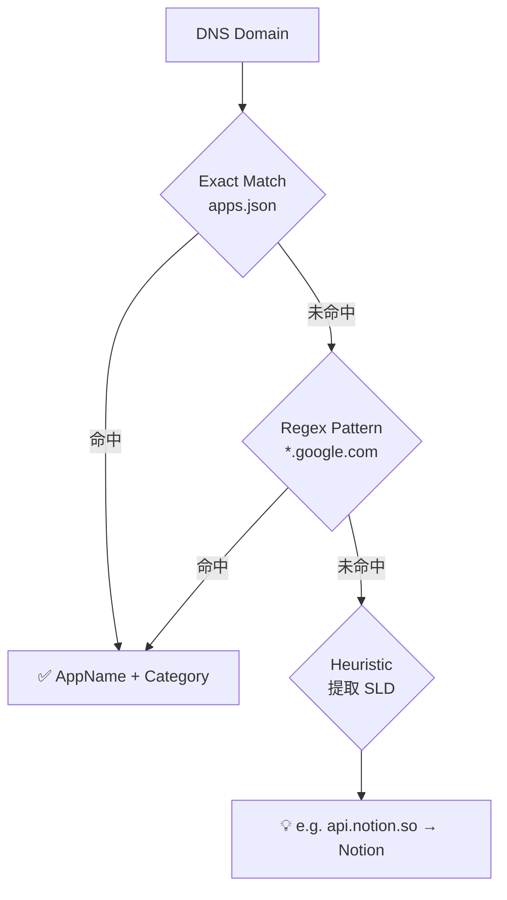

# 08. Concepts

## Domain Model
- **DnsRecord**: 代表單次 DNS 查詢與其豐富化後的資訊。
- **AppRule**: 應用程式識別規則。

## User Interface Concepts
- **Dynamic Layout**: 提供地圖與資訊面板的可調節分割視窗（Resizable Split Panel），適應不同螢幕需求。
- **Interactive Tracing**: 在日誌中點擊目標 Domain 或 IP 直接啟動 Traceroute 追蹤。
- **Cloud Detection**: 前端根據 ASN/ISP 自動標註雲端或 CDN 供應商（AWS, GCP, Cloudflare...）。
- **Onboarding Overlay**: 提供即時顯示的 DNS 設定目標與步驟說明，方便使用者快速切換。

## Security and Privacy
- 無持久化存儲，重啟後數據清空。
- 最小化資訊擷取，僅關注 DNS 層級。
